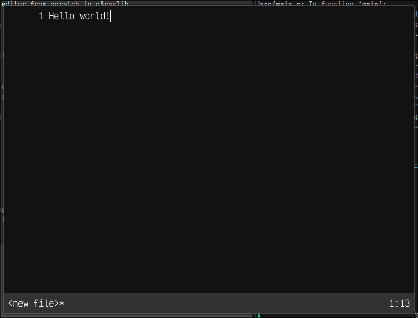
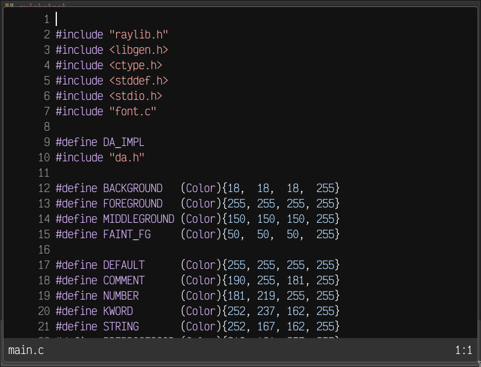

# txt
portable and half usable text editor from-scratch in c&raylib

**note:** this is my first big project in c in general, please be generous

## galery

_Empty buffer with "Hello world" in txt_

_txt's src opened in itself_

## quickstart
compilation under linux:
> to compile for linux run `$ make linux`
> to cross-compile for windows run `$ make windows`
compilation under windows:
> install msys2 and install `gcc` package
> run `$ make windows`, or `$ make windows-console`
> to compile with debug console
compilation under macOS:
> install xcode and run `$ make linux`

to compile bundler run `$ make bundle` 
to use bundler run `$ ./bundle <file> [<another-file>] [...] 2> src/file.c`

also, you can download a build under releases

press <kbd>Ctrl</kbd> + <kbd>H</kbd> for in-app help

## pros+cons
pros:
- basic text editing
- opening and saving of files
- c syntax highlighting

cons:
- tabs (\t) dont work (show up as 1 symbol)
- some more idk

## thanks to
- creators of font Victor Mono, as it is used as default font here

